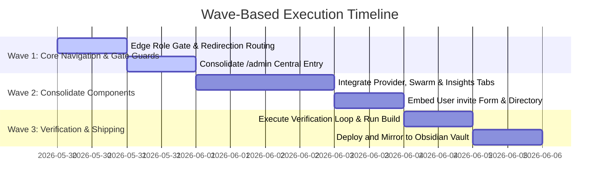

# Plan: Admin Dashboard Expansion (P8)

## 📋 Objective
Create a unified Clinical Operations Mission Control dashboard (`/admin`) accessible strictly to administrators. The console consolidates system provider configurations, swarm operation metrics, medical learning insights, and a secure clinician account invite system under an interactive tabbed layout.

---

## 🚦 User Acceptance Testing (UAT) Criteria

The phase is considered complete and ready to ship when the following criteria are verified:

1. **Gate Guard Enforcement**:
   - Standard users (`clinician`, `viewer`) navigating to `/admin` must receive a polished "Admin access required" message with links to navigate back home or sign in.
   - Unauthenticated visitors navigating to `/admin` must be redirected to `/login?from=%2Fadmin`.
2. **System Metrics Stats**:
   - The dashboard displays current statistics dynamically: Total registered accounts, total Clinicians, total Viewers, and total Admins.
3. **Subsystem Navigation via Tabs**:
   - Admins can cycle smoothly between four specialized control panels:
     * **🔑 Swarm Keys**: Configures and health-checks 12 model providers.
     * **📊 Swarm Operations**: Visualizes complexity routing and emergency detection.
     * **🧠 Learning Insights**: Displays session knowledge gaps and auto-remediation triggers.
     * **👥 Clinician Invites**: Generates new viewer/clinician accounts and directory listings.
4. **Invitation Generation Cycle**:
   - Creating a user dynamically generates a W66-compliant strong password, displays it once via a card with a "Copy" utility, and appends the new user to the adjacent directory.
5. **No Static Errors or Regressions**:
   - Next.js Turbopack compilation runs cleanly without warnings.
   - The test suite is 100% green (**434/434 specs passing**).

---

## 🌊 Wave-Based Implementation Plan

### 🌊 Wave 1: Core Navigation & Gate Guards
1. **Protected Page Route (`src/app/admin/page.tsx`)**:
   - Create a central Next.js page at `/admin` which handles client-side authentication checks on mount.
   - On load, probe `/api/admin/users`. If the request returns a `401 Unauthorized` or `403 Forbidden`, update the state to render a clean, unauthorized access layout with standard navigation paths.
2. **Dashboard Entry Button (`src/app/page.tsx`)**:
   - Conditional rendering check: if the user's active role is `admin`, display a `⚙️ Admin Dashboard` button at the top-left of the homepage beside the `ThemeToggle` and `LogoutButton`.
3. **Login Utility Redirect (`src/app/login/page.tsx`)**:
   - Update the "Admin sign in" floating utility button to point to `/admin`, letting authenticating admins arrive immediately on their control page post-login.

### 🌊 Wave 2: Consolidate Subsystem Components
1. **Consolidated Tabs Layout (`src/app/admin/page.tsx`)**:
   - Structure a sleek header displaying counts for registered accounts.
   - Implement an interactive tab selector (`activeTab`) controlling the render container.
2. **Tabs Implementation**:
   - **Tab 1 (`providers`)**: Embed `<ProviderKeyManager />` inside the dashboard context.
   - **Tab 2 (`swarm`)**: Embed `<ManagerPanel />` to display the active swarm operations complexity.
   - **Tab 3 (`insights`)**: Embed `<InsightsPanel />` for PubMed RAG learnings and knowledge gaps.
   - **Tab 4 (`users`)**: Recreate and embed the full user invitations form and database users directory table from `/admin/users` inside the accounts manager tab.

### 🌊 Wave 3: Verification & Shipping
1. **TypeScript Validation**:
   - Run `npm run typecheck` to confirm zero static compilation errors across the workspace.
2. **Test Baseline Coverage**:
   - Run `npm test` to ensure vitest reports **434/434 green** tests.
3. **Next.js Production Build check**:
   - Execute `npm run build` locally to confirm page compilation is optimized and Edge runtime constraints are satisfied.
4. **Sovereign Ship & Vault Sync**:
   - Stage, commit, and push modifications directly to `main` for Vercel production deployment.
   - Mirror the finalized session updates and roadmap parameters under Obsidian Vault.

---

## 🔍 Verification Checklist

- [ ] Unauthenticated `/admin` request redirects to `/login?from=/admin`.
- [ ] Non-admin `/admin` request displays "Admin access required" warning layout.
- [ ] Admin `/admin` request renders dashboard header and quick stats tiles.
- [ ] Tabs are operational and load correct internal panels.
- [ ] User invitation forms properly write to database, display initial password once, and refresh directory listing.
- [ ] `npm run typecheck` succeeds.
- [ ] `npm test` completes 100% green.
- [ ] `npm run build` succeeds without errors.
