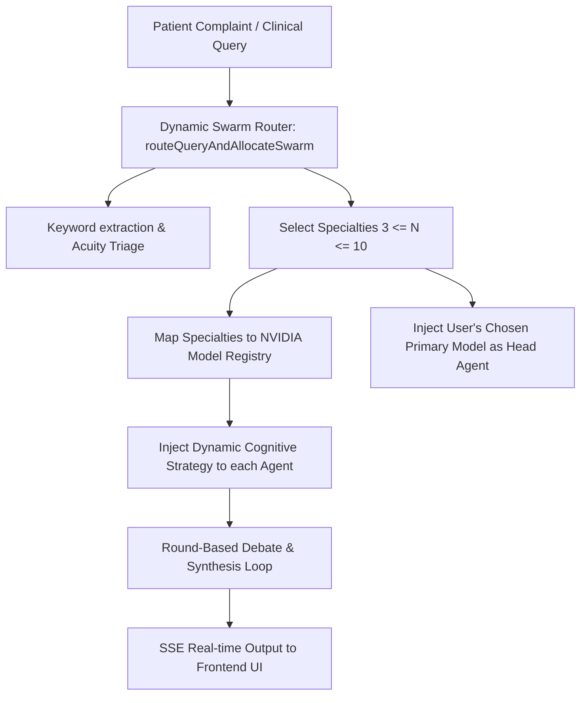

# 🩺 Mediq — SOTA Clinical Intelligence Platform Architecture Deep Dive

This document serves as the absolute technical reference for the **Mediq** Clinical Decision Support System (CDSS). It details the core identity, codebase structure, ingestion pipeline, database architecture, multi-specialty clinical swarm debate logic, and frontend real-time SSE stream synchronization.

---

## 📂 Codebase Directory Structure

```
Mediq/
├── .env.example                # Template for environment configurations
├── .env.local                  # Local development credentials (Neon DB, NVIDIA API Keys)
├── drizzle.config.ts           # Drizzle schema pathing & migration configurations
├── next.config.ts              # Next.js optimization and build phase parameters
├── package.json                # Next.js 16.2.6 (Turbopack) & dependency definitions
├── requirements.txt            # Python dependencies (for auxiliary scrapers/models)
├── tsconfig.json               # TypeScript compiler rules
├── src/
│   ├── proxy.ts                # Local developer proxy configuration
│   ├── app/                    # Next.js App Router endpoints & routes
│   │   ├── globals.css         # Styling system & dark-mode token specifications
│   │   ├── layout.tsx          # Global HTML context, font injection, and styling
│   │   ├── page.tsx            # Main Clinician Dashboard entrypoint
│   │   ├── error.tsx           # Global Error Boundary replacing broken overlays
│   │   ├── login/              # Secure login interface (bypassed in private beta)
│   │   └── api/                # Backend Serverless REST & Streaming API Endpoints
│   │       ├── admin/          # Seed, database wipe, & crawler configurations
│   │       ├── auth/           # Session validation, cookie handling, and access keys
│   │       ├── cases/          # Case logging and database event retrieval
│   │       ├── clinical-swarm/ # Legacy Swarm execution fallback endpoint
│   │       ├── cron/           # CRON-triggered crawlers for scheduled gap-fills
│   │       ├── feedback/       # Clinician-submitted RAG/Swarm debate annotations
│   │       ├── health/         # System diagnostic validation and API status checks
│   │       ├── ingest/         # Direct unstructured text/document ingestion endpoint
│   │       ├── lab-extract/    # Laboratory report parsing and metadata extraction
│   │       ├── provider/       # Custom LLM provider verification endpoints
│   │       ├── provider-key/   # Secure browser-session provider key registration
│   │       ├── query/          # Standard single-agent diagnostic query endpoint
│   │       ├── stats/          # SSR streaming hydrator for historical CDSS stats
│   │       └── swarm/          # Server-Sent Events (SSE) Multi-Agent Swarm Debate Stream
│   ├── components/             # React / TypeScript UI Components
│   │   ├── case-list.tsx       # Saved clinical cases list view
│   │   ├── collapsible-section.tsx # Glassmorphism collapsible layout blocks (w-24 spacers)
│   │   ├── feed-panel.tsx      # Unified Ingestion Feeds & Crawlers UI Controller
│   │   ├── ingest-form.tsx     # Case-file parser & manual text ingestion forms
│   │   ├── insights-panel.tsx  # Dynamic gap detection, risk-flag alerts panel
│   │   ├── manager-panel.tsx   # Swarm trace monitor & debate telemetry visualizer
│   │   ├── provider-key-manager.tsx # API credentials settings overlay (closed by default)
│   │   ├── query-box.tsx       # SOTA clinical input panel, triage stream & debate grids
│   │   ├── stats-loader.tsx    # Hydrates statistical summary metrics in background
│   │   └── theme-toggle.tsx    # Inter/Outfit aesthetic light-to-dark transition
│   ├── db/                     # Database Connection & Query Schema Definition
│   │   ├── index.ts            # Dual connection pools setup (operational & corpus RAG)
│   │   └── schema.ts           # Drizzle table maps (cases, sources, embeddings, events)
│   ├── lib/                    # Core Clinical Logic & Pipeline Utilities
│   │   ├── auth-guard.ts       # Authentication validators & session bypass gates
│   │   ├── crawl-registry.ts   # Sequence registry maps for all 46 clinical crawlers
│   │   ├── crawlers/           # SOTA Crawler Modules (Merck, NICE, WHO, AIIMS, IDSP, etc.)
│   │   ├── drug-safety.ts      # Multi-source pharmacological alerts synthesizers
│   │   ├── feed-refresh.ts     # Health monitors state tracking & cron integration
│   │   ├── feeds.ts            # Active data feeds list specifications
│   │   ├── ingest-pipeline.ts  # Chunking, SHA-256 deduplication, vector push transaction
│   │   ├── lab-parser.ts       # Structured key-value regex-extractor for lab sheets
│   │   ├── manager.ts          # Swarm trace recorder & debate coordinator
│   │   ├── medical-sources.ts  # Structural metadata mappings for clinical references
│   │   ├── nvidia.ts           # NVIDIA API bindings, model mapping, and timeout redirection
│   │   ├── providerRegistry.ts # Unified model preferences and key authorization logic
│   │   ├── rag.ts              # pgvector FAISS-like dense retriever & cosine similarity
│   │   ├── resource-registry.ts# Static core clinical guides corpus
│   │   ├── secretVault.ts      # Encryption helpers for sensitive API key storage
│   │   ├── session-learning.ts # Session cognitive learning and feedback ingestion loop
│   │   ├── statpearls.ts       # Dedicated StatPearls textbook parser
│   │   └── swarm.ts            # Dynamic Clinical Swarm Router, Strategies, & Debates
│   └── __tests__/              # Vitest Automated Test Suite (37 tests)
```

---

## ⚡ 1. SOTA Multi-Specialty Cognitive Swarm

Mediq completely eliminates General Medicine bias by mapping incoming patient complaints to an integrated **21-specialty matrix** covering all **19 MBBS Post-Graduate (PG) specialist subjects**.



### 🧠 Dynamic Cognitive Strategy Engine
Instead of static model-to-prompt bindings, the cognitive strategies are computed dynamically via `getCognitiveStrategyForSpecialty(specialty, model)`. Every specialist agent in the debate receives a specialized system prompt, strict clinical guidelines, and cognitive mandates:

1. **Critical & Emergency Care** (`emergency`) — **ABCDE First**: Focus strictly on acute threats (tamponade, tension pneumothorax, pulmonary embolism, cardiogenic shock, airway occlusion). Mandate immediate action urgency tiers:
   - **STAT**: Urgent life-threat intervention (minutes / <1h).
   - **Urgent**: Critical assessment (1-6h).
   - **Routine**: Stable ward workup (<24h).
2. **Oncology & Malignancy** (`cancer_care`, `gynae_oncology`) — **Worst-Case & Red Flag Hunter**: Systematically search for occult malignancies, evaluate FIGO/TNM staging parameters, identify paraneoplastic masqueraders, and screen for oncologic emergencies (spinal cord compression, tumor lysis, hypercalcemia).
3. **Women's Health & Maternal Fetal** (`obstetrics_gynaecology`) — **Maternal-Fetal Safety Shield**: Enforce absolute maternal-fetal safety rules. Check CTG patterns, biophysical profiles, and pregnancy trimesters. Restrict pharmacological recommendations to FDA Category A/B agents; explicitly red-flag Category X teratogens.
4. **Pediatrics & Neonatal** (`paediatric_care`) — **Age-Adapted Developmental Triage**: Tailor clinical parameters strictly to age and pediatric development (mg/kg dosing, Holliday-Segar fluid equations). Actively screen for neonatal sepsis, Kawasaki disease, and intussusception.
5. **Surgical & Operative** (`chest_surgery`, `plastic_surgery`, `ent`) — **Surgical Safety & Operative Viability Audit**: Map complex anatomy, vascular landmarks, and surgical margins. Calculate ASA and Goldman cardiac indices. Establish clear, objective clinical thresholds triggering conversion from conservative trial to emergency operative intervention.
6. **Imaging & Diagnostics** (`diagnostic_radiology`) — **Structured Radiographic Interpretation**: Standardize imaging assessments using radiologic classification systems (BI-RADS, LI-RADS, PI-RADS, Lung-RADS). Grade differentials by radiologic probability; mandate contrast safety checks (eGFR targets).
7. **Foundational Pre/Para-Clinical** (`clinical_pathology`, `pharmacology_safety`, `liver_transplant`, `bone_marrow_transplant`, `lung_transplant`) — **Basic Sciences Pathophysiological Anchor**: Trace clinical presentations from foundational cellular pathobiology, biochemical disruptions, histological slide patterns, or microbial resistance markers to systemic symptoms.
8. **Outpatient, Chronic, & Mental Health** (`psychiatry`, `system_entryway`) — **Occam's Razor & Holistic Parsimony**: Prioritize a single, unified diagnostic entity explaining the full symptom cluster. Create pragmatic outpatient plans, evaluate polypharmacy risk (Beers criteria), and provide safety-netting boundaries.
9. **Clinical Medicine (Default)** — **Bayesian Organ-System Review**: Evaluate base rates by age/gender. Systematically apply the **VINDICATE** mnemonic (Vascular, Infectious, Neoplastic, Degenerative, Iatrogenic, Congenital, Autoimmune, Traumatic, Endocrine) to frame pre-test probabilities.

### 🏥 The 21-Specialty / 19-PG Subject Mapping Matrix

| Department | PG Subject | ID | NVIDIA Model Preference |
| :--- | :--- | :--- | :--- |
| **System Entryway** | Community Medicine | `system_entryway` | `mistralai/ministral-14b-instruct-2512` |
| **Cardiac Care** | Physiology / Anatomy | `cardiac_care` | `nvidia/llama-3.3-nemotron-super-49b-v1` |
| **Cancer Care** | Pathology / Oncology | `cancer_care` | `openai/gpt-oss-120b` |
| **Neurosciences** | Anatomy / Neurology | `neurosciences` | `qwen/qwen3-next-80b-a3b-instruct` |
| **Gastrosciences** | General Surgery | `gastrosciences` | `nvidia/nemotron-3-super-120b-a12b` |
| **Orthopaedics** | Orthopedics | `orthopaedics` | `mistralai/mixtral-8x22b-instruct-v0.1` |
| **Renal Care** | Biochemistry | `renal_care` | `meta/llama-3.3-70b-instruct` |
| **Liver Transplant** | Surgery / Immunology | `liver_transplant` | `meta/llama-3.3-70b-instruct` |
| **Bone Marrow Transplant** | Hematology / Pathology | `bone_marrow_transplant` | `nvidia/llama-3.1-nemotron-70b-instruct` |
| **Lung Transplant** | Pulmonology / Thoracic | `lung_transplant` | `meta/llama-3.3-70b-instruct` |
| **Chest Surgery** | Thoracic Surgery | `chest_surgery` | `meta/llama-3.3-70b-instruct` |
| **Gynae-Oncology** | Pathology / Gynecology | `gynae_oncology` | `openai/gpt-oss-120b` |
| **Pediatric Care** | Pediatrics | `paediatric_care` | `nvidia/nemotron-nano-12b-v2-vl` |
| **Obstetrics** | Obstetrics | `obstetrics_gynaecology` | `meta/llama-3.3-70b-instruct` |
| **Emergency** | Forensic Med / Anesthesia | `emergency` | `meta/llama-4-maverick-17b-128e-instruct` |
| **Otolaryngology** | ENT (Otolaryngology) | `ent` | `mistralai/ministral-14b-instruct-2512` |
| **Reconstructive Surgery** | Plastic Surgery | `plastic_surgery` | `meta/llama-3.3-70b-instruct` |
| **Diagnostic Imaging** | Radiodiagnosis | `diagnostic_radiology` | `nvidia/nemotron-nano-12b-v2-vl` |
| **Pathology** | Pathology (Histology) | `clinical_pathology` | `nvidia/llama-3.1-nemotron-70b-instruct` |
| **Clinical Pharmacist** | Pharmacology | `pharmacology_safety` | `nvidia/nemotron-3-super-120b-a12b` |
| **Psychiatry** | Psychiatry | `psychiatry` | `nvidia/nemotron-nano-12b-v2-vl` |

### 🛠️ Robust Model Redirection & API Safeguards
To secure the multi-agent clinical swarm against sudden API latency spikes, quota locks, or connection timeouts of large models (such as `Nemotron Super 120B` or `Nemotron Super 49B`), `src/lib/nvidia.ts` and `src/lib/providerRegistry.ts` implement robust model redirection maps:
- `nvidia/nemotron-3-super-120b-a12b` → mapped to highly stable `meta/llama-3.3-70b-instruct`.
- `nvidia/llama-3.3-nemotron-super-49b-v1` → mapped to `meta/llama-3.3-70b-instruct`.
- Outgoing API calls to Ruflo/NVIDIA endpoints feature a robust **60-second execution abort guard** (`AbortController` timeout) to ensure rapid failover and prevent blocking the Server-Sent Events stream.

---

## 💾 2. Hybrid Database & Hobby-Scale Storage Split

To ensure extreme performance and protect database storage from the **512 MB Free Tier limit** imposed by Neon, Mediq splits database interactions into two separate PostgreSQL connection pools configured inside `src/db/index.ts`:

```
                  ┌──────────────────────────────────────────────┐
                  │              Next.js Backend                 │
                  └──────────────────────┬───────────────────────┘
                                         │
                    Is RIVESTACK_DATABASE_URL defined?
                     /                               \
                   Yes                               No
                   /                                   \
┌──────────────────────────────┐            ┌──────────────────────────────┐
│       dbCorpus Pool          │            │       Single db Pool         │
│  (RIVESTACK_DATABASE_URL)    │            │        (DATABASE_URL)        │
├──────────────────────────────┤            ├──────────────────────────────┤
│ - Large Embeddings table     │            │ - Handles All Tables:        │
│ - Cosine RAG Vectors (384d)  │            │   - cases, sources,          │
│ - Static Reference Corpus    │            │     embeddings, events       │
└──────────────────────────────┘            └──────────────────────────────┘
```

1. **Operational Database Connection (`db`)**:
   - Wired to standard `DATABASE_URL`.
   - Manages high-frequency low-size relational transactional tables: `cases`, `sources`, `manager_events`, `session_learning`.
2. **Dense RAG Corpus Database Connection (`dbCorpus`)**:
   - If `RIVESTACK_DATABASE_URL` is configured, `dbCorpus` points directly to the secondary `Medicine AI Backup` database.
   - Manages the storage-heavy `embeddings` table holding dense 384-dimensional pgvector RAG embeddings.
   - If `RIVESTACK_DATABASE_URL` is omitted, the system gracefully falls back to the primary `db` pool, consolidating tables under a unified schema.

### 🗃️ Database Table Definitions (`src/db/schema.ts`)
- **`sources`**: Tracks scraped textbooks, guidelines, and articles. Contains `contentHash` and `urlHash` to prevent duplicative parsing.
- **`embeddings`**: Houses segmented text chunks (`content`) linked to their parent `sourceId` and matching vector embeddings.
- **`cases`**: Records clinician patient profiles, diagnostic queries, and the final synthesized debate transcripts.
- **`manager_events`**: Stores telemetry logs from swarm sessions (active specialists, triage sizing, strategies, timeline events).
- **`session_learning`**: Synthesizes clinician feedback and corrective overrides into a localized reinforcement learning layer.

---

## 🕷️ 3. Dense Reference Crawling & RAG Ingestion Pipeline

Mediq aggregates medical literature, emergency protocols, and treatment guidelines across **46 clinical crawlers** unified under a sequential, fully controllable **Master Ingestion Flow**.

```
    Web Resource / PDF Link
               │
               ▼
   [Specific Ingestion Crawler]  ──► Strips formatting / extracts raw text
               │
               ▼
  [sanitizeTextForPostgres] ──► Encodes invalid chars, deletes null bytes (\u0000)
               │
               ▼
      [SHA-256 Hash check]    ──► Matches contentHash & urlHash in "sources"
         (If exists, skips!)
               │
               ▼
      [Text Chunking]         ──► Splits raw text into dense semantic ranges
               │
               ▼
  [Vector Generation API]     ──► Produces 384-dimensional dense float vector
               │
               ▼
  [Postgres Transaction]      ──► Stores source metadata and links vector chunks
```

### 🧬 Ingestion Pipeline Logic (`src/lib/ingest-pipeline.ts`)
1. **Deduplication Engine**: Generates unique SHA-256 hashes of the URL and page text. If `sources` already contains matching hashes, the pipeline skips indexing.
2. **Text Chunking**: Segmentizes unstructured texts into standardized, semantically complete sentences within dense target context sizes.
3. **Null-Byte Sanitization**: The database ingestion features a strict text sanitization utility:
   ```typescript
   export function sanitizeTextForPostgres(text: string): string {
     return text.replace(/\u0000/g, '');
   }
   ```
   This strips null bytes (`\u0000`) commonly encountered during text extraction from clinical PDFs (e.g., AIIMS Guidelines) to prevent PostgreSQL `invalid byte sequence for encoding` transaction crashes.
4. **Transaction Persistence**: Executes a combined, atomic Drizzle transaction. Inserts the source metadata, grabs the generated `sourceId`, and pushes all vector chunks to the `embeddings` table.

### 🌐 The 46-Specialist Crawler Ecosystem
Wired sequentially via the Master Ingestion Flow, these crawlers fetch, scrape, and parse data from diverse medical resources:
- **Major Textbooks & Clinical Guidelines**:
  - `StatPearls`: Comprehensive structured clinical guidelines.
  - `Merck Manual`: Core disease profiles and medical differential matrices.
  - `NICE Guidelines`: UK evidence-based healthcare standards.
  - `WHO Guidelines`: Global healthcare and diagnostic protocols.
  - `ICMR Guidelines`: Indian Council of Medical Research primary guidelines.
  - `AIIMS Protocols`: Specialized clinical protocols from the All India Institute of Medical Sciences (integrates `pdf-parse` for robust PDF extraction).
- **Emergency & Triage Manuals**:
  - `WikiEM`: Emergency medicine guidelines database.
  - `LITFL (Life in the Fast Lane)`: Critical care and toxicology reference manual.
  - `MDCalc`: Medical scoring guidelines, calculators, and risk assessment indices.
- **Pharmacological & Toxicology Sources**:
  - `DailyMed`: FDA official label drug databases.
  - `WHO Essential Medicines`: Core catalog of essential global medications.
  - `PubChem Compounds`: Detailed toxicological, structural, and receptor-binding files.
  - `OpenFDA FAERS`: FDA adverse event reports tracking drug safety signals.
  - `PvPI Alerts`: Pharmacovigilance Programme of India drug safety alerts.
  - `NLEM 2022`: National List of Essential Medicines (India).
- **Specialized Registries**:
  - `Gene Reviews`: Clinical genetics, molecular diagnostics, and rare syndromic files.
  - `Orphadata`: Orphanet portal for rare diseases and orphan drugs metadata.
  - `OMIM`: Online Mendelian Inheritance in Man database mapping genomic phenotypes.
  - `ClinicalTrials.gov`: Active clinical trial progress maps.
  - `PubMed Central`: Dense peer-reviewed journal abstract databases.

---

## 📡 4. SSE Real-Time Streaming & UI Synchronization

The main Clinician Dashboard syncs with the multi-agent swarm debate through a dedicated Server-Sent Events (SSE) stream (`src/app/api/swarm/route.ts`).

### 🔄 The Real-Time SSE Loop

```
      Browser Client                         Next.js SSE Route
            │                                       │
            ├───────── POST /api/swarm ────────────►│ (Triggers routeQueryAndAllocateSwarm)
            │                                       │
            │◄─────── Event: swarm_config ──────────┤ (Sends: swarmSize, departments, PG subjects)
            │                                       │
            │◄─────── Event: manager_status ────────┤ (Updates pre-flight dashboard messages)
            │                                       │
            │◄─────── Event: agent_start ───────────┤ (Initializes agent visual nodes)
            │                                       │
            │◄─────── Event: agent_token ───────────┤ (Streams agent reasoning tokens in real-time)
            │                                       │
            │◄─────── Event: agent_complete ────────┤ (Completes individual agent debate turn)
            │                                       │
            │◄─────── Event: synthesis_token ───────┤ (Streams final consolidated response tokens)
            │                                       │
            │◄─────── Event: done ──────────────────┤ (Terminates connection, logs case in DB)
```

1. **Query Triage Stage**: Browser triggers a POST request to `/api/swarm`. The server extracts keywords, assigns matching specialties, sets a dynamic swarm size ($3 \le N \le 10$), and immediately establishes the SSE text stream.
2. **Config Broadcast (`swarm_config`)**: Before streaming text, the server broadcasts the exact selected specialties, MBBS PG subjects, and dynamic swarm size. The client (`query-box.tsx`) listens for `swarm_config` and updates its `swarmSize` React state in real-time. The visual debate grids and progress bars instantly resize to match the dynamically allocated swarm before any text chunks are generated.
3. **Telemetry Streaming (`manager_status`)**: Delivers real-time status updates from the swarm coordinator (e.g., "Manager: Cardiology analyzing ECG parameters...").
4. **Agent Debate Streaming (`agent_token`)**: As models generate reasoning in parallel, the tokens are streamed to the frontend, updating each specialty agent's glassmorphic visual card on the clinician dashboard.
5. **Synthesis Stage (`synthesis_token`)**: Runs a consensus model to synthesize conflicting agent opinions into a unified, guideline-anchored clinical decision support output.

---

## 💎 5. Premium UI Design & Layout Architecture

The Mediq user interface is built on premium, responsive, glassmorphic layout components designed to alleviate clinical cognitive overload:

- **Symmetry Offset Spacers (`src/components/collapsible-section.tsx`)**:
  To ensure mathematically perfect text centering inside collapsible header components across desktop viewports, Mediq implements symmetry offsets. A hidden desktop spacer (`hidden w-24 shrink-0 sm:block`) is placed on the left side of the title. This perfectly balances the `w-24` expand/collapse action toggle button on the right, ensuring clean alignment. On mobile, the header stacks vertically (`flex-col items-center gap-3`) to prevent overlaps.
- **Glassmorphic Design Tokens**:
  Utilizes curated, harmonious HSL palettes tailored for low-eye-strain clinical environments. Avoids browser-default styling in favor of modern Google Fonts (Inter & Outfit) and vibrant, soft gradients.
- **Node-Eyebrow Support**:
  Sections support React nodes in their eyebrows, allowing the rendering of complex metadata badges (e.g., real-time feed statuses, dynamic model indicators) directly inside standard headers.

---

## ⚖️ Clinical Disclaimer & Compliance
Mediq operates in a stealth private beta and is strictly designed as a clinical decision support tool for educational exploration and review by licensed healthcare professionals. It does not constitute medical advice or a substitute for professional clinical judgment. Always cross-reference recommendations with institutional protocols and local healthcare guidelines.
